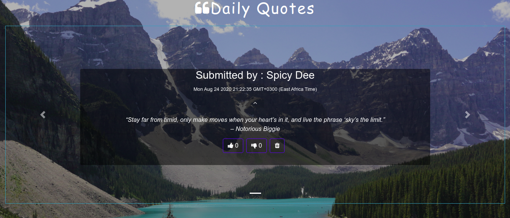
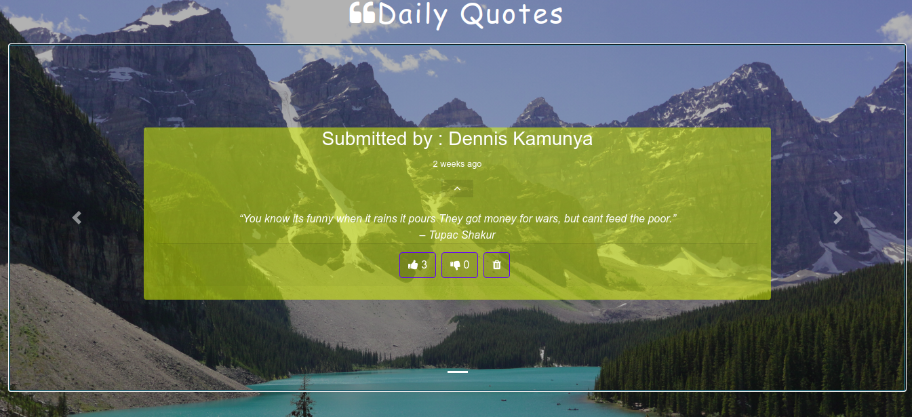
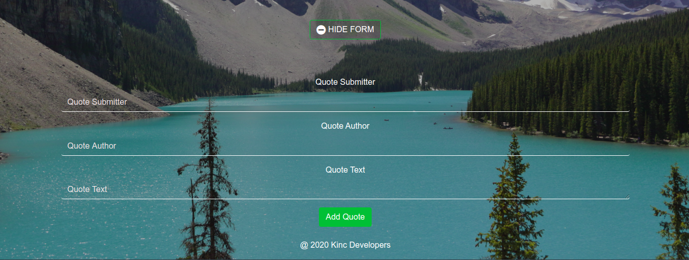

# Quote Hub
### 21.08.2020
####  An angular web application which allows users to post and rate their favourite quotes.

## Author
[Dennis Kamunya](https://github.com/D-Kamunya)

## Versioning
Quote App V1.0

## Description
A web application which allows users to add their quotes. The user can see posts from other users and can either upvote , downvote ,or delete the quote.The app also highlights the quote with the highest upvote by adding a yellow background
The link to the live site is https://d-kamunya.github.io/Quotes-App/
## Features
Here are the features in summary:
* A carousel that slides through the posted quotes.
* A dropdown to reveal the quote text and its author.
* A like and dislike button to upvote and downvote a qote.
* A delete button to delete a quote.
* A button to toggle the add quote form.
* A form to submit a new quote.

## Behaviour Driven Development (BDD)
|Behaviour 	           |    Input 	                 |       Output          |
|----------------------------------------------|:-----------------------------------:|-----------------------------:|       
|Page loads, reveals an interactive carousel which contains the quotes posted                         |   User clicks, the post your quote button to reveal form.             |Submitting the form will post it on the carousel    |                       |

## Setup/Installation Requirements
* **Installation**

* Clone this repository using **`git clone https://github.com/D-Kamunya/Quotes-App.git`**, or downloading a ZIP file of the code.
* The repository, if downloaded as a .zip file will need to be extracted to your preferred location and opened
* Open the terminal, go to the project directory and download the dependencies in the package.json using **`npm install`**

* **Development server**

Run `ng serve` for a dev server. Navigate to `http://localhost:4200/`. The app will automatically reload if you change any of the source files.

* **Code scaffolding**

Run `ng generate component component-name` to generate a new component. You can also use `ng generate directive|pipe|service|class|guard|interface|enum|module`.

* **Build**

Run `ng build` to build the project. The build artifacts will be stored in the `dist/` directory. Use the `--prod` flag for a production build.

* **Running unit tests**

Run `ng test` to execute the unit tests via [Karma](https://karma-runner.github.io).

* **Running end-to-end tests**

Run `ng e2e` to execute the end-to-end tests via [Protractor](http://www.protractortest.org/).
To view the app, open the live site link provided below on the README.
Here is a run through of how to set up the application:

## Technologies Used
* Angular
* HTML  
* CSS
* Typescript
* Bootstrap 4
* Angular Bootstrap
* font-awesome

## Contribution
Pull requests are welcome. For major changes, please open an issue first to discuss what you would like to change.
## Support and contact details
If you run into any problems feel free to contact me @dennismuriithik@gmail.com
#### License

Permission is hereby granted, free of charge, to any person obtaining a copy of this software and associated documentation files (the "Software"), to deal in the Software without restriction, including without limitation the rights to use, copy, modify, merge, publish, distribute, sublicense, and/or sell copies of the Software, and to permit persons to whom the Software is furnished to do so, subject to the following conditions:

The above copyright notice and this permission notice shall be included in all copies or substantial portions of the Software.

THE SOFTWARE IS PROVIDED "AS IS", WITHOUT WARRANTY OF ANY KIND, EXPRESS OR IMPLIED, INCLUDING BUT NOT LIMITED TO THE WARRANTIES OF MERCHANTABILITY, FITNESS FOR A PARTICULAR PURPOSE AND NONINFRINGEMENT. IN NO EVENT SHALL THE AUTHORS OR COPYRIGHT HOLDERS BE LIABLE FOR ANY CLAIM, DAMAGES OR OTHER LIABILITY, WHETHER IN AN ACTION OF CONTRACT, TORT OR OTHERWISE, ARISING FROM, OUT OF OR IN CONNECTION WITH THE SOFTWARE OR THE USE OR OTHER DEALINGS IN THE SOFTWARE.

Copyright (c) 2020 Dennis Kamunya

